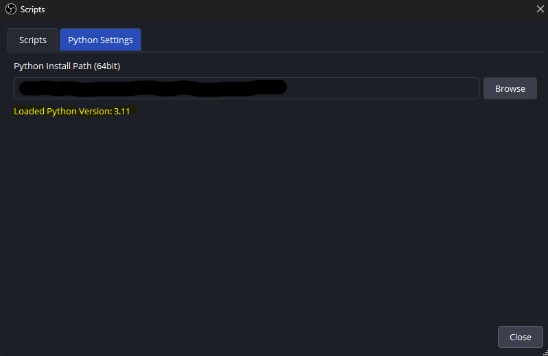
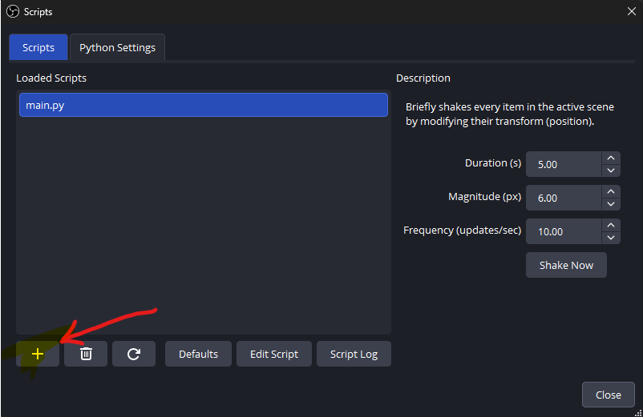

# Shake Everything - OBS Script

A fun OBS Studio script that shakes all scene items in your current scene with a configurable shake effect. Perfect for adding dynamic visual effects triggered by hotkeys or Stream Deck buttons!

## Important: This is NOT a Regular Python Script

**This script only works inside OBS Studio.** You cannot run it from the command line like a typical Python script. It uses the `obspython` module which is built directly into OBS Studio and is not available as a standalone package.

## Requirements

- **OBS Studio** (version 27.0 or newer recommended)
- **Python 3.11** (64-bit or 32-bit to match your OBS installation)
  - Note: Python 3.13 is currently not supported by OBS
  - Python 3.9, 3.10, or 3.11 are recommended

## Installation

### Step 1: Install Compatible Python

1. Check if you have OBS 64-bit or 32-bit:
   - Open OBS Studio
   - Go to **Help → About**
   - Look for "64-bit" or "32-bit" in the version info

2. Download Python 3.11 from [python.org](https://www.python.org/downloads/release/python-3119/)
   - Choose **Windows installer (64-bit)** if you have 64-bit OBS
   - Choose **Windows installer (32-bit)** if you have 32-bit OBS

3. Run the installer:
   - Choose "Customize installation"
   - Install to a memorable location (e.g., `C:\Python311`)
   - You can optionally check "Add Python to PATH" but it's not required for OBS

### Step 2: Configure Python in OBS

1. Open **OBS Studio**
2. Go to **Tools → Scripts**
3. Click the **Python Settings** tab at the top

4. Click **Browse** and navigate to your Python installation folder (e.g., `C:\Python311`)
5. OBS should now display the detected Python version

### Step 3: Load the Script

1. Stay in **Tools → Scripts**
2. Click the **Scripts** tab at the top
3. Click the **+** (plus) button at the bottom left

4. Navigate to and select `main.py` from this repository
5. The script should now appear in the list and load successfully

## Usage

### Configure the Effect

In the Scripts panel, you'll see three settings:

- **Duration (s)**: How long the shake effect lasts (default: 0.5 seconds)
- **Magnitude (px)**: How far items move during the shake (default: 200 pixels)
- **Frequency (updates/sec)**: How smooth the shake appears (default: 30 fps)

Adjust these to your liking!

### Trigger the Shake

You have three ways to trigger the shake effect:

#### Option 1: Manual Button (Testing)
- Click the **"Shake Now"** button in the script properties panel
- Great for testing your settings

#### Option 2: Keyboard Hotkey
1. Go to **Settings → Hotkeys** in OBS
2. Scroll down to find **"Shake Everything"**
3. Click in the field and press your desired key (e.g., F13, F14, etc.)
4. Click **OK** to save

#### Option 3: Stream Deck (Recommended)
1. Set up a hotkey in OBS (see Option 2 above)
2. In your Stream Deck software:
   - Add a **"Hotkey"** action to a button
   - Configure it to press the same key you set in OBS
   - Optionally customize the button icon/text

The Stream Deck will now trigger the shake effect when pressed!

## How It Works

The script works by:
1. Capturing all scene items in your current scene
2. Recording their original positions
3. Randomly offsetting their positions each frame
4. Gradually reducing the shake intensity (damping)
5. Restoring original positions when the duration expires

All modifications are temporary - your scene items return to their exact original positions after the shake.

## Troubleshooting

### "Python 3.11 could not be found"
- Ensure you've installed Python 3.11 (not 3.13 or newer)
- Verify the architecture matches (64-bit Python for 64-bit OBS)
- Point OBS to the correct folder in **Tools → Scripts → Python Settings**

### "No module named 'obspython'"
- This error means you're trying to run the script from the command line
- The script must be loaded through **Tools → Scripts** in OBS Studio
- `obspython` only exists inside OBS's scripting environment

### Script loads but doesn't do anything
- Check that you have items in your current scene
- Verify the hotkey is properly configured in **Settings → Hotkeys**
- Try clicking the "Shake Now" button to test

### Hotkey doesn't work
- Make sure the hotkey isn't conflicting with other OBS or system hotkeys
- Try using function keys (F13-F24) which are rarely used by other software
- For Stream Deck, use the OBS hotkey integration instead of simulating keypresses

## Customization

Feel free to modify the script! Some ideas:

- Change the shake pattern (try sine waves instead of random)
- Add rotation or scaling to the shake
- Create different shake presets
- Add source filtering (shake only certain types of sources)

## License

Feel free to use, modify, and distribute this script as you wish!

## Support

If you encounter issues:
1. Verify you're using Python 3.11 or earlier
2. Check that OBS detects your Python installation
3. Ensure the script loads without errors in the Scripts panel
4. Test with the "Shake Now" button before setting up hotkeys

Happy shaking!
